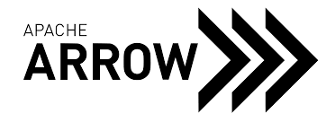

# Using Apache Arrow/Parquet data with kdb+

[Apache Arrow](https://arrow.apache.org/) is a software-development platform for building high-performance applications that process and transport large datasets. It is designed to both improve the performance of analytical algorithms and the efficiency of moving data from one system (or programming language to another).

A critical component of Apache Arrow is its **in-memory columnar format**, a standardized, language-agnostic specification for representing structured, table-like datasets in memory. This data format has a rich datatype system (included nested data types) designed to support the needs of analytic database systems, dataframe libraries, and more.

## Arrow and Parquet

[Apache Parquet](https://parquet.apache.org/) is a storage format designed for maximum space efficiency, using advanced compression and encoding techniques. It is ideal for minimizing disk usage while storing gigabytes of data, or perhaps more. The efficiency comes at the cost of relatively expensive reading into memory, as Parquet data cannot be directly operated on but must be  decoded in large chunks.

Conversely, Apache Arrow is an in-memory format meant for direct and efficient use for computational purposes. Arrow data is not compressed but laid out in  natural format for the CPU, so that data can be accessed at arbitrary places at full speed. 

Arrow and Parquet complement each other, with Arrow being used as the in-memory data structure for deserialized Parquet data.

## Arrow/kdb+ integration

This interface lets you convert data between Arrow tables and kdb+
to analyze data in whichever format you are more familiar with.  

Currently Arrow supports over 35 datatypes including concrete, parameterized and nested datatypes.  Each [Arrow datatype is mapped to a kdb+ type](arrow-types.md) and `arrowkdb` can seamlessly convert between both representations.

The data layout of an Arrow table is defined by its schema.  The schema is composed from a list of fields, one for each column in the table.  The field  describes the name of the column and its datatype.  Schemas can be setup in two ways:

Inferred schemas

: If you are less familiar with Arrow or do not wish to use the more complex or nested Arrow datatypes, `arrowkdb` can infer the schema from a kdb+ table.  Each column in the table is mapped to a field in the schema.  The column’s name is used as the field name and the field’s datatype is [inferred from the column’s kdb+ type](arrow-types/#inferred-datatypes).

Constructed schemas

: Although inferred schemas are easy to use, they support only a subset of the Arrow datatypes and are considerably less flexible. The inference works only for kdb+ tables where the columns contain simple datatypes. Where more complex schemas are required then these should be manually constructed. This is done using the datatype/field/schema constructor functions which `arrowkdb` exposes, similar to the C++ Arrow library and PyArrow.

## Arrow tables

Users can read and write Arrow tables created from kdb+ data using:

-   Parquet file format
-   Arrow IPC record batch file format
-   Arrow IPC record batch stream format

Separate APIs are provided where the Arrow table is either created from a kdb+ table using an inferred schema or from an Arrow schema and the table’s list of array data.

:point_right:
[API reference](reference.md)
 
:point_right:
[Example implementations](examples.md)
 
[Install guide](../README.md#installation)

## Project

The `arrowkdb` interface is published under an Apache 2.0 license.

-    [Raise an issue](https://github.com/KxSystems/arrowkdb/issues)
-    [Contribute](../CONTRIBUTING.md)
